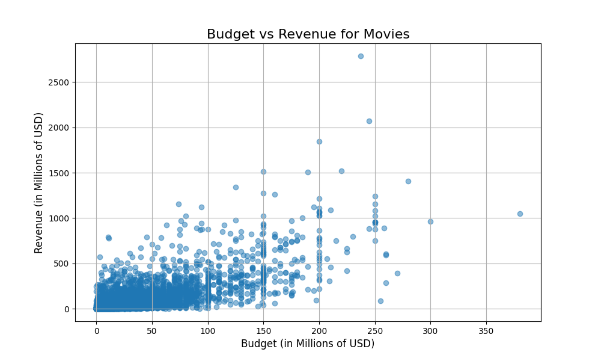

# IMDb Movie Dataset Analysis 🎬

## Project Description

This project is an exploratory data analysis (EDA) of The Movie Database (TMDb) dataset. The primary goal is to clean and prepare the raw data, and then uncover insights and relationships using Python. The analysis relies on the Pandas library for data manipulation and Matplotlib for creating visualizations.

---

## Key Questions & Findings

This analysis sought to answer two main questions:

#### 1. What is the distribution of movie ratings?
- **Finding:** After filtering out movies with fewer than 10 votes, the data shows a distribution centered around average-to-good ratings, with a peak between 6.0 and 7.5 out of 10. This suggests that extremely low-rated movies are relatively rare once a minimum number of votes is considered.


#### 2. What is the relationship between a movie's budget and its revenue?
- **Finding:** There is a clear positive correlation between budget and revenue. Generally, movies with higher budgets tend to generate higher revenues. However, the data also shows significant variance, highlighting the existence of low-budget successes and high-budget commercial flops.



---

## Dataset

The dataset used for this analysis is the "The Movies Dataset" from Kaggle, which contains metadata for over 45,000 movies.

- **Source:** [Kaggle - The Movies Dataset](https://www.kaggle.com/datasets/rounakbanik/the-movies-dataset)

---

## Tools and Libraries Used

* **Python**
* **Pandas** (for data cleaning and analysis)
* **Matplotlib** (for data visualization)

---

## How to Run This Project

1.  Clone this repository to your local machine.
2.  Download the dataset from the Kaggle link above and place the `movies_metadata.csv` file into the project's root directory.
3.  Install the required libraries:
    ```bash
    pip install pandas matplotlib
    ```
4.  Run the Python script:
    ```bash
    python main.py
    ```